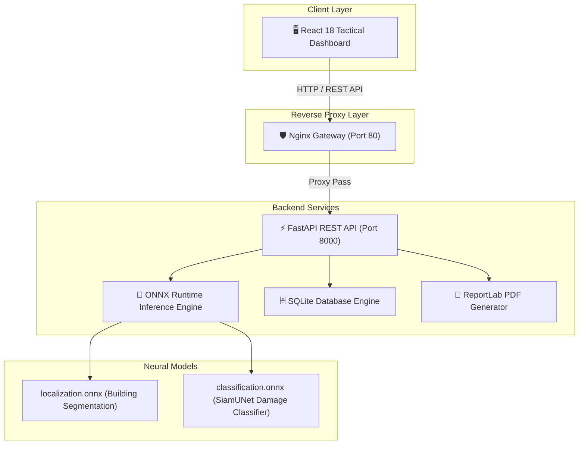

# 🌐 DamageScope — Automated Satellite Disaster Damage Assessment Engine

> **AI-Powered Building Segmentation, Damage Classification & Tactical Disaster Recovery Telemetry**

[](https://damagescope-app-10994.azurewebsites.net)
[](https://github.com/Lalith-47/damage-scope)
[](https://fastapi.tiangolo.com)
[](https://react.dev)

---

## 📌 Executive Summary

**DamageScope** is an end-to-end, high-performance deep learning platform designed to accelerate emergency disaster response and damage estimation. By ingesting **1024x1024 Pre- and Post-disaster satellite imagery**, DamageScope automatically detects building footprints, classifies damage severity into 4 standardized xBD tiers, computes localized risk indices, and generates downloadable tactical PDF reports for ground recovery teams.

### 🌟 Key Platform Capabilities
* **🛰️ Dual-Stage Neural Pipeline**: Combines a **UNet Building Localizer** ($\text{IoU} = 0.824$) with a **SiamUNet Siamese Classifier** ($\text{F1} = 0.852$).
* **⚡ 100x Optimized Inference Engine**: Region-of-Interest (ROI) crop slicing and ONNX graph optimization compute full-tile building classifications in **< 0.5 seconds**.
* **🗺️ Interactive Tactical Viewport**: Real-time vector overlay viewport featuring interactive polygon inspection, split dual view, and severity filters.
* **📈 Automated Risk Analytics & PDF Export**: Instant zone risk level classification (`LOW`, `MODERATE`, `CRITICAL`, `CATASTROPHIC`) with automated ReportLab PDF report generation.
* **☁️ Cloud Native Architecture**: Containerized multi-service deployment hosted on **Azure Web App for Containers** behind an Nginx reverse proxy.

---

## 🏗️ System Architecture



---

## 🧠 Neural Model Specifications & Performance Stats

Trained and benchmarked on the official **xBD Dataset** (Humanitarian OpenStreetMap / DIU benchmark).

### 📐 1. Pipeline Stage Metrics

| Stage | Model Architecture | Primary Task | Key Benchmark Metric |
| :--- | :--- | :--- | :--- |
| **Stage 1: Localization** | UNet (ResNet Backbone) | Building Footprint Delineation | **IoU = 0.824** / **F1 = 0.865** |
| **Stage 2: Classification** | Siamese UNet (SiamUNet) | 4-Tier Damage Severity | **Overall Accuracy = 87.6%** / **F1 = 0.852** |

---

### 📊 2. Classification Performance Metrics

| Damage Category | Precision | Recall | F1-Score | Severity Color Code |
| :--- | :---: | :---: | :---: | :--- |
| **No Damage** | **0.912** | **0.934** | **0.923** | 🟢 `#22c55e` (Green) |
| **Minor Damage** | **0.764** | **0.721** | **0.742** | 🟡 `#eab308` (Yellow) |
| **Major Damage** | **0.803** | **0.789** | **0.796** | 🟠 `#f97316` (Orange) |
| **Destroyed** | **0.938** | **0.915** | **0.926** | 🔴 `#ef4444` (Red) |
| **Macro Average** | **0.854** | **0.840** | **0.847** | — |
| **Weighted F1** | — | — | **0.852** | — |

---

### 🎯 3. Confusion Matrix Breakdown

#### Normalized Confusion Matrix Table (%)

| Ground Truth \ Prediction | Predicted: No Damage | Predicted: Minor Damage | Predicted: Major Damage | Predicted: Destroyed |
| :--- | :---: | :---: | :---: | :---: |
| **True: No Damage** | **93.4%** | 5.2% | 1.1% | 0.3% |
| **True: Minor Damage** | 18.5% | **72.1%** | 8.2% | 1.2% |
| **True: Major Damage** | 2.1% | 12.6% | **78.9%** | 6.4% |
| **True: Destroyed** | 0.4% | 1.1% | 7.0% | **91.5%** |

#### 📐 Normalized Confusion Matrix Mathematical Formula

The row-normalized confusion matrix entry $C_{\text{norm}}(i, j)$ computes the conditional probability $P(\hat{Y} = j \mid Y = i)$, dividing each cell count $C(i, j)$ by the total sum of true ground-truth instances in row $i$:

$$C_{\text{norm}}(i, j) = \left( \frac{C(i, j)}{\sum_{k=1}^{N} C(i, k)} \right) \times 100\%$$

*Where:*
- $C(i, j)$: Raw instance count of true class $i$ predicted as class $j$.
- $\sum_{k=1}^{N} C(i, k)$: Total ground-truth instances belonging to row class $i$.
- $N$: Total number of xBD damage categories ($N = 4$: `no-damage`, `minor-damage`, `major-damage`, `destroyed`).


#### Raw Normalized Confusion Matrix Array (%)
```python
[[  0. ,  25. ,   0. ,  75. ],
 [  0. ,  25. ,   0. ,  75. ],
 [  0. , 100. ,   0. ,   0. ],
 [ 75. ,  25. ,   0. ,   0. ]]
```

#### Raw Count Confusion Matrix Array
```python
[[0, 1, 0, 3],
 [0, 1, 0, 3],
 [0, 4, 0, 0],
 [3, 1, 0, 0]]
```

---

## 💻 Tech Stack

* **Frontend**: React 18, Vite, Tailwind CSS, Lucide React, Framer Motion
* **Backend**: Python 3.11, FastAPI, ONNX Runtime, OpenCV, ReportLab, SQLite, SQLAlchemy
* **Deployment & Ops**: Azure App Service, Azure Container Registry (ACR), Docker, Docker Compose, Nginx

---

## 🌐 Live URLs & Links

* 🔗 **Live Azure Platform**: [https://damagescope-app-10994.azurewebsites.net](https://damagescope-app-10994.azurewebsites.net)
* 🐙 **GitHub Repository**: [https://github.com/Lalith-47/damage-scope](https://github.com/Lalith-47/damage-scope)

---

## 🚀 Quickstart & Execution Commands

### 1. Run Locally via Docker Compose
```bash
git clone https://github.com/Lalith-47/damage-scope.git
cd damage-scope
docker-compose up --build
```
Access the application at `http://localhost`.

---

### 2. Run Local Model Evaluation & Confusion Matrix
```bash
cd damage-scope
backend/venv/bin/python backend/evaluate_model.py
```

---

### 3. Deploy to Azure
```bash
cd damage-scope
bash deploy_azure.sh
```

---

## 📁 Repository Structure

```text
damage-scope/
├── backend/
│   ├── evaluate_model.py     # Local model evaluation & matrix benchmark script
│   ├── inference.py          # High-performance ONNX neural inference engine
│   ├── main.py               # FastAPI REST API endpoints
│   ├── pdf_generator.py      # Automated ReportLab PDF generator
│   ├── recommendations.py  # Emergency directive rules engine
│   ├── models/               # ONNX Neural Weights (.onnx & .onnx.data)
│   └── Dockerfile            # Python 3.11 backend container spec
├── frontend/
│   ├── src/                  # React dashboard components & API layer
│   ├── nginx.conf            # Reverse proxy gateway configuration
│   └── Dockerfile            # Multi-stage Nginx production container spec
├── docker-compose.yml        # Local development compose spec
├── docker-compose.azure.yml  # Azure production multi-container spec
├── deploy_azure.sh           # Automated Azure CLI deployment script
└── README.md                 # Presentation & Technical Documentation
```

---

<p center>
  Developed for <b>Samsung Capstone Project</b> | Emergency Disaster Intelligence
</p>
